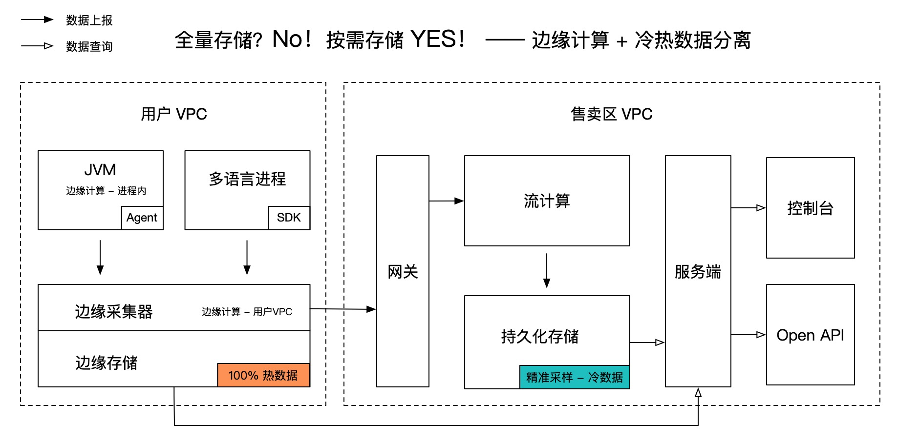
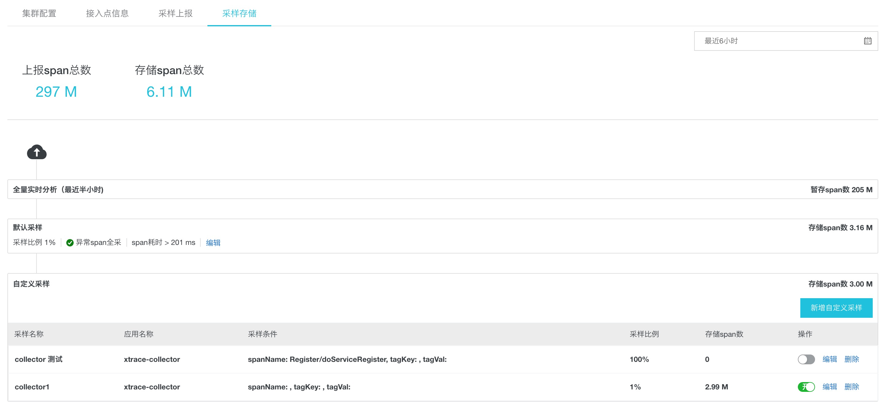
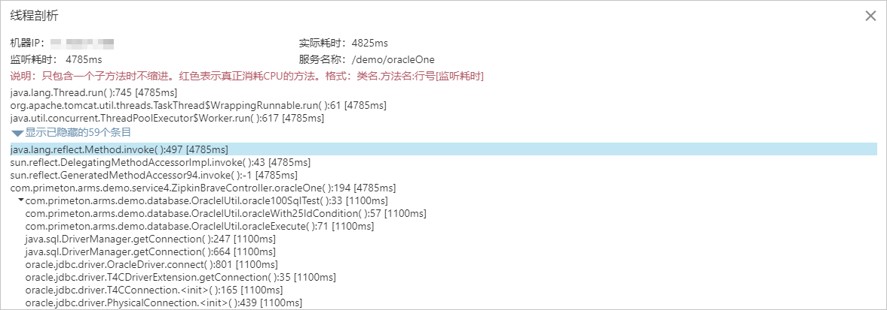
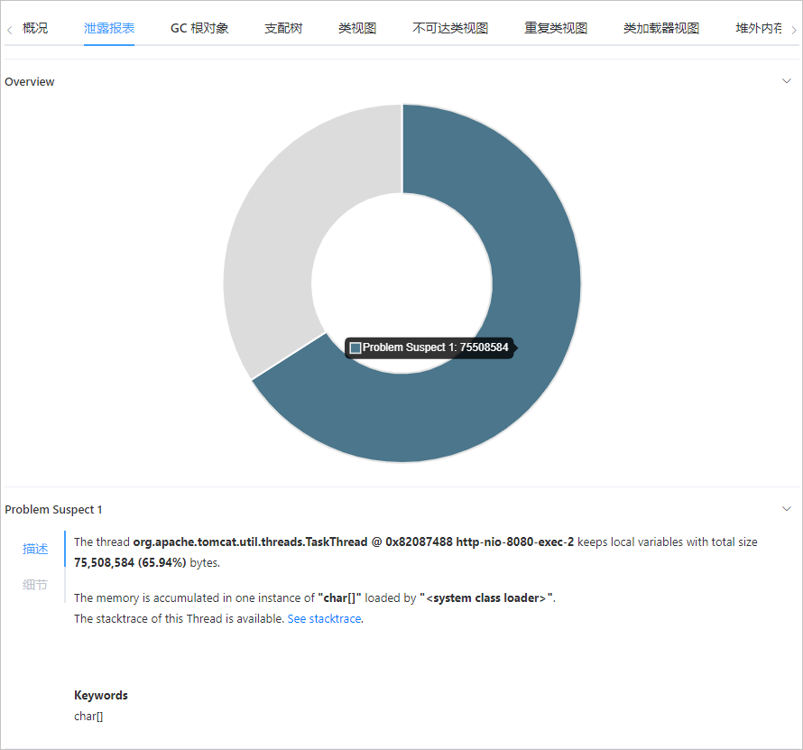
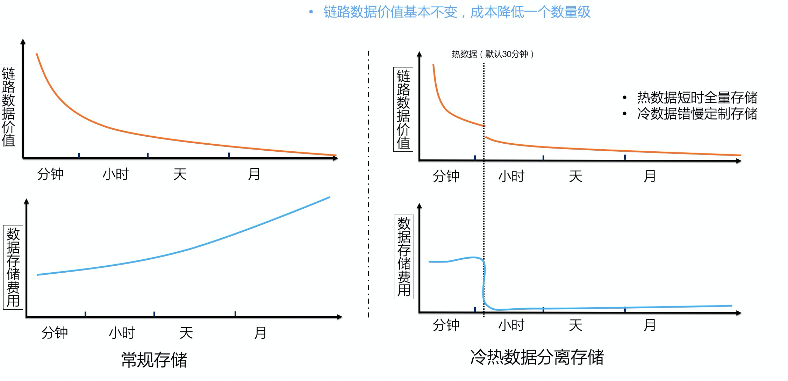
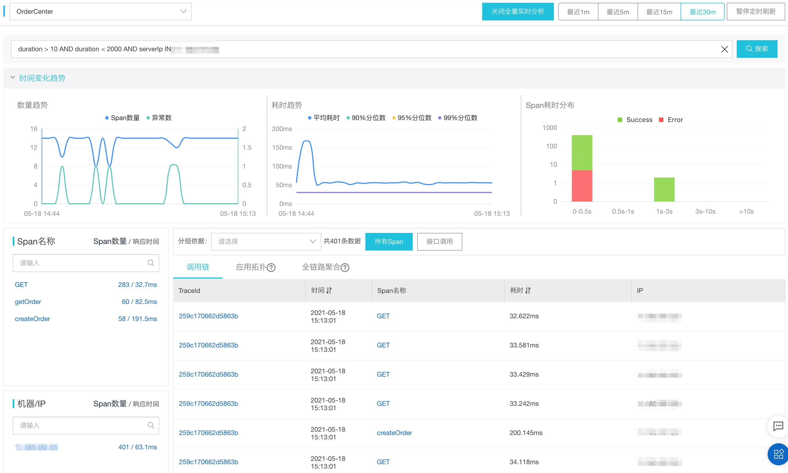
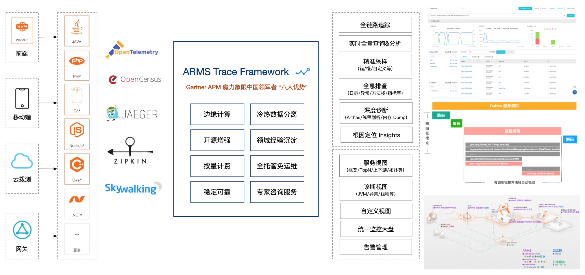

# 链路追踪（Tracing）其实很简单——全量存储? No! 按需存储? YES!

> 作者：夏明（涯海）    
> 创作日期：2021-05-18  
> 专栏地址：[【稳定大于一切】](https://github.com/StabilityMan/StabilityGuide)  
> PDF 格式：[链路追踪（Tracing）其实很简单——全量存储? No! 按需存储? YES!](https://github.com/StabilityMan/StabilityGuide/blob/master/docs/diagnosis/tracing/pdf/链路追踪（Tracing）其实很简单——全量存储%3FNo!按需存储%3FYES!.pdf)

调用链记录了完整的请求状态及流转信息，是一座巨大的数据宝库。但是，其庞大的数据量带来的成本及性能问题是每个实际应用 Tracing 同学绕不开的难题。如何以最低的成本，按需记录最有价值的链路及其关联数据，是本文探讨的主要话题。 **核心关键词是：边缘计算 + 冷热数据分离。** 如果你正面临全量存储调用链成本过高，而采样后查不到数据或图表不准等问题，请耐心读完本文，相信会给你带来一些启发。

## 目录
- [边缘计算，记录更有价值的数据](#边缘计算记录更有价值的数据)
	- [筛选更有价值的数据](#筛选更有价值的数据)
	- [提炼数据价值](#提炼数据价值)
- [冷热数据分离，低成本满足个性化的后聚合分析需求](#冷热数据分离低成本满足个性化的后聚合分析需求)
	- [冷热数据分离方案简述](#冷热数据分离方案简述)
	- [热数据实时全量分析](#热数据实时全量分析)
	- [冷数据持久化采样分析](#冷数据持久化采样分析)
- [结语](#结语)
- [推荐产品](#推荐产品)
- [加入我们](#加入我们)

## 边缘计算，记录更有价值的数据
边缘计算，顾名思义就是在边缘节点进行数据计算，赶时髦的话也可以称之为“计算左移”。在网络带宽受限，传输开销与全局数据热点难以解决的背景下， **边缘计算是寻求成本与价值平衡最优解的一种有效方法。**

Tracing 领域最常用的边缘计算就是在用户进程内进行数据过滤和分析。而在公有云环境，用户集群或专有网络内部的数据加工也属于边缘计算，这样可以节省大量的公网传输开销，并分散全局数据计算的压力。

此外，从数据层面看，边缘计算一方面可以筛选出更有价值的数据，另一方面可以通过加工提炼数据的深层价值，以最小的成本记录最有价值的数据。

### 筛选更有价值的数据
**链路数据的价值分布是不均匀的。** 据不完全统计，调用链的实际查询率小于百万分之一。全量存储数据不仅会造成巨大的成本浪费，也会显著影响整条数据链路的性能及稳定性。如下列举两种常见的筛选策略。

* **基于链路数据特征进行调用链采样上报（Tag-based Sampling）。** 比如错/慢调用全采，特定服务每秒前N次采样，特定业务场景自定义采样等。下图展示了[阿里云 ARMS 自定义采样配置页面](https://help.aliyun.com/document_detail/194773.html)，用户可以根据自身需要自由定制存储策略，实际存储成本通常小于原始数据的 5%。

* **异常场景下自动保留关联数据现场。** 我们在诊断问题根因时，除了调用链之外，还需要结合日志、异常堆栈、本地方法耗时、内存快照等关联信息进行综合判断。如果每一次请求的关联信息全都记录下来，大概率会造成系统的崩溃。因此， **能否通过边缘计算自动保留异常场景下的快照现场是衡量 Tracing 产品优劣的重要标准之一。** 如下图所示，阿里云 ARMS 产品提供了[慢调用线程剖析](https://help.aliyun.com/document_detail/87560.html)，[内存异常 HeapDump](https://help.aliyun.com/document_detail/72191.html) 等能力。

无论哪种筛选策略，其核心思想都是 **通过边缘节点的数据计算，丢弃无用或低价值数据，保留异常现场或满足特定条件的高价值数据。** 这种基于数据价值的选择性上报策略性价比远高于全量数据上报，未来可能会成为 Tracing 的主流趋势。

### 提炼数据价值
除了数据筛选，在边缘节点进行数据加工，比如预聚合和压缩，同样可以在满足用户需求的前提下，有效节省传输和存储成本。

* 预聚合统计：在客户端进行预聚合的最大好处， **就是在不损失数据精度的同时大幅减少数据上报量。** 比如，对调用链进行 1% 采样后，仍然可以提供精准的服务概览/上下游等监控告警能力。
* 数据压缩：对重复出现的长文本（如异常堆栈，SQL 语句）进行压缩编码，也可以有效降低网络开销。结合非关键字段模糊化处理效果更佳。

## 冷热数据分离，低成本满足个性化的后聚合分析需求
边缘计算可以满足大部分预聚合分析场景，但是无法满足多样化的后聚合分析需求，比如某个业务需要统计耗时大于3秒的接口及来源分布，这种个性化的后聚合分析规则是无法穷举的。而当我们无法预先定义分析规则时，貌似就只能采用成本极高的全量原始数据存储。难道就没有优化的空间么？答案是有的，接下来我们就介绍一种低成本解决后聚合分析问题的方案——冷热数据分离。

### 冷热数据分离方案简述
**冷热数据分离的价值基础在于用户的查询行为满足时间上的局部性原理。** 简单理解就是，最近的数据最常被查询，冷数据查询概率较小。例如，由于问题诊断的时效性，50% 以上的链路查询分析发生在 30分钟内，7天之后的链路查询通常集中在错慢调用链。理论基础成立，接下来讨论如何实现冷热数据分离。

首先，热数据存在时效性，如果只需记录最近一段时间内的热数据，对于存储空间的要求就会下降很多。另外，在公有云环境下，不同用户的数据天然具备隔离性。因此，在用户 VPC 内部的热数据计算和存储方案就具备更优的性价比。

其次，冷数据的查询具备指向性，可以通过不同的采样策略筛选出满足诊断需求的冷数据进行持久化存储。例如错慢采样，特定业务场景采样等。由于冷数据存储周期较长，对稳定性要求较高，可以考虑在 Region 内统一管理。

综上所述，热数据存储周期短，成本低，但可以满足实时全量后聚合分析需求；而冷数据经过精准采样后数据总量大幅下降，通常只有原始数据量的 1% ~10%，并可以满足大多数场景的诊断诉求。两相结合，实现了成本与体验的平衡最优解。国内外领先的 APM 产品，如 ARMS、Datadog、Lightstep 均采用了冷热数据分离的存储方案。

### 热数据实时全量分析
链路明细数据包含了最完整最丰富的的调用信息，APM 领域最常用的服务面板、上下游依赖、应用拓扑等视图均是基于链路明细数据统计得出。基于链路明细数据的后聚合分析可以根据用户个性化需求更有效的定位问题。但是，后聚合分析的最大挑战是要基于全量数据进行统计，否则会出现样本倾斜导致最终结论离实际相差甚远。

阿里云 ARMS 作为 2021 年 Gartner APM 魔力象限中国唯一入选云厂商，提供了 30分钟内热数据全量分析的能力，可以实现各种条件组合下的过滤与聚合，如下图所示：

### 冷数据持久化采样分析
全量调用链的持久化存储成本非常高，而前文提到 30分钟后调用链的实际查询率不足百万分之一，并且大多数的查询集中在错慢调用链，或满足特定业务特征的链路，相信经常排查链路问题的同学会有同感。因此，我们应该只保留少量满足精准采样规则的调用链，从而极大的节省冷数据持久化存储成本。

那么精准采样应该如何实现呢？业界常用的方法主要分为头部采样（Head-based Sampling）和尾部采样（Tail-based Sampling）两种。头部采样一般在客户端 Agent 等边缘节点进行，例如根据接口服务进行限流采样或固定比例采样；而尾部采样通常基于全量热数据进行过滤，如错慢全采等。

**最理想的采样策略应该只存储真正需要查询的数据**，APM 产品需要提供灵活的采样策略配置能力与最佳实践，用户结合自身业务场景进行自适应的调整。

## 结语
当越来越多的企业和应用上云，公有云集群规模爆发式增长，“成本”将是企业用云的关键衡量因素。而在云原生时代，充分利用边缘节点的计算和存储能力，结合冷热数据分离实现高性价比的数据价值探索已经逐渐成为 APM 领域的主流。全量数据上报、存储、再分析这种传统方案将面临越来越大的挑战。未来会如何，让我们拭目以待。

## 推荐产品
* [阿里云 ARMS —— 2021 年 Gartner APM 魔力象限中国唯一入选云厂商](https://help.aliyun.com/document_detail/42966.html)
* [Tracing Analysis —— 兼容 OpenTracing 规范，支持 7 种开发语言](https://help.aliyun.com/document_detail/90277.html)

## 加入我们
【稳定大于一切】打造国内稳定性领域知识库，**让无法解决的问题少一点点，让世界的确定性多一点点**。

* [GitHub 地址](https://github.com/StabilityMan/StabilityGuide)
* 钉钉群号：23179349
* 如果阅读本文有所收获，欢迎分享给身边的朋友，期待更多同学的加入！

